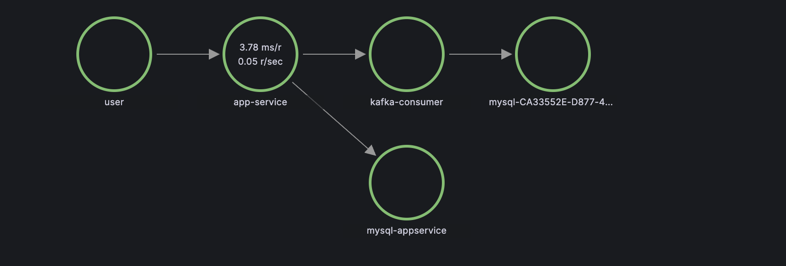

# Gradle Monorepo: Spring Boot 4, Kotlin 2.3 & Observability

This repository serves as a **reference architecture** and **starter template** for building modern, scalable microservices using **Spring Boot 4** and **Kotlin 2.3** within a strictly typed **Gradle Monorepo**.

It demonstrates best practices for build logic reuse, dependency management, and a complete **OpenTelemetry-based Observability Stack** (Prometheus, Loki, Tempo, Alloy, Grafana).

---

## 🚀 Key Features

### 1. Modern Toolchain
- **Spring Boot 4.0.1**: ready for the next generation of Java/Kotlin development.
- **Kotlin 2.3.0**: Leveraging the latest language features.
- **Gradle 8+**: High-performance build tool.

### 2. Gradle Build Logic & Version Catalog
Move away from repetitive build scripts. This repo uses **Convention Plugins** in `build-logic` to share configuration across the monorepo:
- **`buildlogic.kotlin-common-conventions`**: Shared Kotlin settings.
- **`buildlogic.kotlin-application-conventions`**: Spring Boot & Docker setup for services.
- **`libs.versions.toml`**: Centralized dependency management (Version Catalog).

### 3. Full Observability Stack (LGTM + Alloy)
A pre-configured observability pipeline using **Grafana Alloy** as the central collector:
- **Metrics**: Spring Boot Micrometer $\rightarrow$ Alloy $\rightarrow$ **Prometheus**
- **Logs**: Logback OTLP Appender $\rightarrow$ Alloy $\rightarrow$ **Loki**
- **Traces**: Micrometer Tracing $\rightarrow$ Alloy $\rightarrow$ **Tempo**
- **Visualization**: **Grafana** pre-wired with datasources.


### 4. Kafka Producer and Consumer

The project implements a comprehensive Kafka producer and consumer flow to demonstrate event-driven architecture and observability.

#### Architecture

1.  **Producer (`app-service`)**:
    -   The `ProductService` creates a `ProductCreatedEvent` and publishes it to the `product-created-events-topic`.
    -   It uses a configured `KafkaTemplate` with observation enabled to propagate traces.

2.  **Consumer (`kafka-consumer`)**:
    -   The `ProductCreatedEventHandler` listens to the `product-created-events-topic`.
    -   It uses `@KafkaListener` and a configured `ConcurrentKafkaListenerContainerFactory` with observation enabled to continue the trace context.

#### End-to-End Traces Propagation

With Spring Boot 3/4 and Micrometer Tracing (replacing Spring Cloud Sleuth), the application automatically handles trace context propagation over Kafka headers.

-   **Trace Context w3c**: The `traceparent` and `tracestate` headers are injected into the Kafka message by the producer.
-   **Extraction**: The consumer extracts these headers and starts a new span that is a child of the producer's span.

This ensures that you can visualize the entire lifecycle of a request in Grafana Tempo, from the initial REST call to `app-service` to the asynchronous processing in `kafka-consumer`.


*Figure: End-to-end trace visualization in Grafana showing the span propagation from Producer to Consumer.*

### 4. Infrastructure as Code
- **Docker Compose**: Orchestrates the entire stack.
- **Gradle Tasks**: Custom tasks to build containers, run infrastructure, and deploy the app seamlessly.

---

## 🛠️ Getting Started

### Prerequisites
- **Docker & Docker Compose** (running)
- **JDK 23** (recommended, though Gradle handles toolchains)

### Build & Run Application
This repository includes custom Gradle tasks to simplify the Docker workflow.

| Task                      | Command                                   | Description                                 |
|---------------------------|-------------------------------------------|---------------------------------------------|
| **Spotless Apply**        | `./gradlew spotlessApply `                | check and apply code format (`app-service:latest`). |
| **Build & Run Container** | `./gradlew dockerComposeUp`               | Build & Runs the container in detached mode. |
| **Stop**                  | `./gradlew dockerComposeDown`             | Stops and removes container.     |

### Run Full Stack (Infra + App)
To spin up the entire observability stack alongside the application:

```bash
./gradlew dockerComposeUp
```
This runs `docker-compose.infra.yaml` (Observability) + `app-service/docker-compose.yaml` (App).

To tear everything down:
```bash
./gradlew dockerComposeDown
```
---

### Example Request Payload
```curl
curl --location 'http://localhost:8080/products' \
--header 'Content-Type: application/json' \
--data '{
    "title": "Macbook",
    "price": 3999.99,
    "quantity": 1
}'
```

---

## 📦 Project Structure

```text
├── build-logic/                  # Custom Convention Plugins
│   └── src/main/kotlin/          # Kotlin source for build logic
├── gradle/
│   └── libs.versions.toml        # Version Catalog (Dependencies)
├── app-service/                  # Example Spring Boot 4 Service
│   ├── src/                      # Source code
│   ├── Dockerfile                # Configured for Layered JARs
│   └── docker-compose.yaml       # App specific compose file
├── kafka-consumer/                  # Example Spring Boot 4 Service
│   ├── src/                      # Source code
│   ├── Dockerfile                # Configured for Layered JARs
│   └── docker-compose.yaml       # App specific compose file
├── common-events/                  # Module to keep common schema
│   ├── src/                      # avro schema
├── observability/                # Configs for Observability Stack
│   ├── alloy/                    # Alloy collector config
│   ├── grafana/                  # Datasources
│   ├── loki/                     # Loki config
│   ├── prometheus/               # Prometheus config
│   └── tempo/                    # Tempo config
└── docker-compose.infra.yaml     # Infra (Prometheus, Loki, Tempo, Alloy, Grafana)
```

---

## 📊 Observability Endpoints

Once the stack is running via `dockerComposeUp`, access the following dashboards:

| Service | URL | Usage |
|---------|-----|-------|
| **Application** | `http://localhost:8080` | The generic Spring Boot app. |
| **Grafana** | `http://localhost:3000` | Visualize Metrics, Logs, and Traces. (Login: admin/admin) |
| **Prometheus** | `http://localhost:9090` | Raw Metrics Query. |
| **Tempo** | `http://localhost:3200` | Trace backend (usually accessed via Grafana). |
| **Alloy** | `http://localhost:12345` | Collector UI (Status & Targets). |

---

## 📝 How to Use This Template

1.  **Copy `build-logic`**: Drop the folder into your root to get instant Kotlin & Spring Boot conventions.
2.  **Copy `gradle/libs.versions.toml`**: Use this as a base for your dependency versions.
3.  **Adapt `settings.gradle.kts`**: meaningful project structure.
4.  **Use Convention Plugins**: In your modules, just apply the plugin:
    ```kotlin
    plugins {
        id("buildlogic.kotlin-application-conventions")
    }
    ```
    This automatically gives you `bootJar`, `dockerBuild`, and OTLP readiness.

---

### Author
Designed to demonstrate the power of **Gradle Monorepos** and **Spring Boot 4 Observability**.
